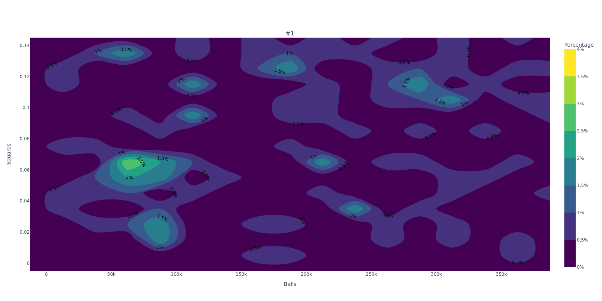
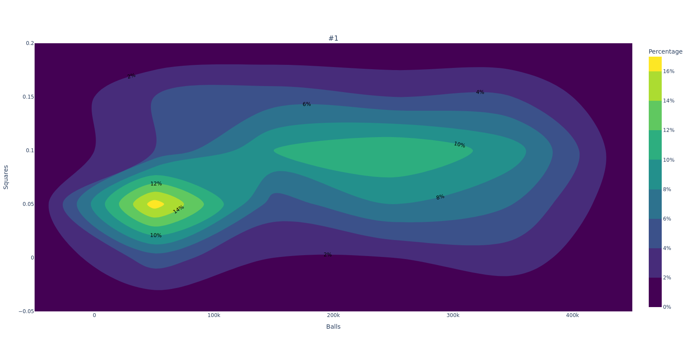
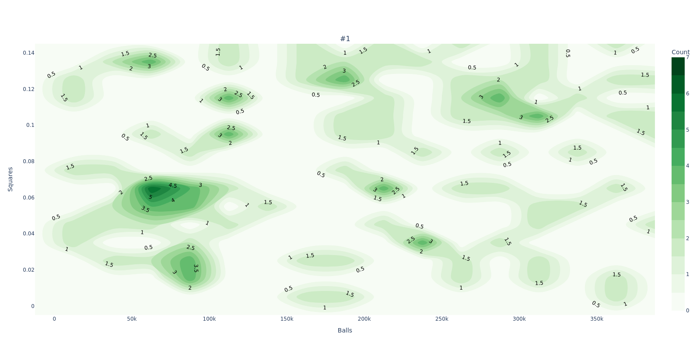

# grouped-data-to-2d-histogram

[](https://github.com/ninja-asa/grouped-data-to-2d-histogram/actions/workflows/unit-tests.yml) 


[](https://opensource.org/licenses/MIT)

This repository fulfills the simple purpose of generating 2D Histogram Contour plots (using [plotly](https://plotly.com/python/2d-histogram-contour/)) for a given grouped data.

## Pre-requisites
- Python 3.10 or higher
- `pip` package manager or `poetry` package manager
- Clone this repos
- Docker (optional) - in case you use Visual Studio Code devcontainer

## Getting Started
### Usage
1. Install dependencies, either using `pip` or `poetry`
```bash	
# Using pip
pip install .
```
```bash
# Using poetry
poetry install
```
2. Check if your data is in the expected format. More details in the [Supported Formats](#Supported-formats) section.
3. Open `main.py` and update the configuration as needed. More details in the [Configuration](#Configuration) section 
> :exclamation: not pretty, I know
4. Run the script
```bash
python main.py
```
5. The script will generate the 2D Histogram Contour plots for each group of data points and all the groups combined. The plots will be saved in the `output/` directory, in a folder named with the current timestamp. Examples can be found in the [Examples](#Examples) section.

### Development
1. Clone this repository
2. Open the project in Visual Studio Code.

3. When prompted, reopen the project in a container using the provided `.devcontainer` configuration.

4. Install required Python packages by running the following command in the terminal:

    ```bash
    poetry install
    ```

## Supported Formats
Two types of data formats are supported:
- Excel
- CSV

In `data/` directory, you can find the sample data files.
| #1    |         | #2    |         | #3    |         |
|-------|---------|-------|---------|-------|---------|
| Balls | Squares | Balls | Squares | Balls | Squares |
| 85736 | 0.08405 | 141628| 0.09772 | 79654 | 0.08743 |
| 8653  | 0.08358 | 160066| 0.09936 | 44244 | 0.07755 |

The tabular data is expect to be grouped at the top level. The first row is the group name, and the second row is represents features of data points per group. 

## Configuration
The script `main.py` contains several configuration options that you can adjust to customize the visualization. Here's a brief explanation of each option:

`excel_file`: The path to the Excel file containing the data to visualize. The file should be in `.csv` or `.xlsx` format.

`DEBUG`: A boolean value that, when set to `True`, enables debug mode.

`features`: A list of two strings that match the feature names in the Excel file. These features will be used for the visualization. If left empty, the first two features in the Excel file will be used.

The `Histogram2DContourSettings` object contains several options for customizing the histogram:

`min_feature_1`, `max_feature_1`, `min_feature_2`, `max_feature_2`: The minimum and maximum values for the first and second features. Set to None to auto-calculate these values from the provided data.

`feature_1_bin_size`, `feature_2_bin_size`: The bin size for the first and second features. Set to `None` to auto-calculate these values from the provided data. Recommended to set these values to get a consistent visualization.

`hist_colorbar_min`, `hist_colorbar_max`: The minimum and maximum values for the colorbar. Set to `None` to auto-calculate these values from the provided data. Recommended to set these values to get a consistent visualization.

`colorscale`: The colorscale for the histogram. Check Plotly's documentation for available colorscales.

`contours`: A dictionary that controls the appearance of the contours. showlabels controls whether to show the number of counts/percentage in each contour, and `labelfont` controls the color of the labels.

`contour_filling`: Set to `"fill"` to fill the contours with color, or "lines" to show only the lines of the contours.

`contour_show_lines`: Set to `True` to show the lines of the contours.

`normalized`: Set to `True` to show the percentage of counts in each contour, or `False` to show the count of each contour.

The `VisualizeSettings` object contains several options for customizing the multiplot figure:

`horizontal_spacing`: The horizontal spacing between subplots.

`vertical_spacing`: The vertical spacing between subplots.

`fig_suplots_width`: The width of the figure.

`fig_subplot_height_per_row`: The height of each row in the figure.

## Examples
### Auto Configuration
Config can be found in `samples/configAuto.py`.



### Manual Configuration - Normalized Scale
Config can be found in `samples/configNormalized.py`.



### Manual Configuration - Count Scale

Config can be found in `samples/configCount.py`.

